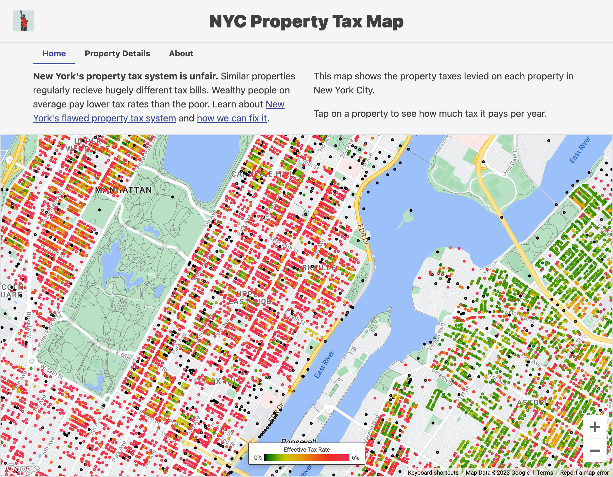

# NYC Property Tax Map
This repository hosts the code to produce [Sidewalk Chrous](https://wew.sidewalkchorus.com)'s [New York City Property Tax Map](https://taxmap.sidewalkchorus.com/). It's an interactive map that allows viewers to see the valuation and property tax bills for every piece of land in New York City.

This map was created by [Sebastian Hallum Clarke](https://www.sebthedev.com), the author of Sidewalk Chorus.

## Why NYC needs a property tax map
New York's property tax system is unfair. An incredibly complicated set of rules result in different properties paying hugely different effective tax rates. In general, this results in:
* Tax rates being higher on low-value homes and tax rates being incredibly low on high-value homes.
* Tax rates being higher on multi-family residential buildings than on single-family homes.
* Tax rates being higher on rental buildings than similar owner-occupied condominium buildings.

This is bad for New York because:
* It's unfair, and an unfair tax system harms trust in the government.
* It's regressive, which is antithetical to a progressive, prosperous city.
* It distorts the housing market in ways that discourage constructing multi-family buildings and discourage constructing rental buildings, which elevates house prices and rent for everyone.

These facts are obscured from most New Yorkers, however. Tax isn't a sexy topic, and many New Yorkers never even recieve a property tax bill because their home's payments are handled by a landlord, co-op association, or mortgage lender. 

This property tax map is an attempt to bring more transparency to New York's property tax system. It reveals how much tax each property is charged, and demonstrates how wildly uneven and regressive our system is.

[View the map](https://taxmap.sidewalkchorus.com), educate yourself, and then lobby your legislators at the city council, state assembly, and state senate to take action.

## About the data
### Generating the data table
The NYC Property Tax Map uses data from several data tables published by the City of New York. Generating the data table that powers the map requires joining these tables together.

The data sources are:
* [Property Valuation and Assessment Data Tax Classes 1,2,3,4](https://data.cityofnewyork.us/City-Government/Property-Valuation-and-Assessment-Data-Tax-Classes/8y4t-faws) table, published by the NYC Department of Finance on the NYC Open Data portal
* [Primary Land Use Tax Lot Output (PLUTO)](https://data.cityofnewyork.us/City-Government/Primary-Land-Use-Tax-Lot-Output-PLUTO-/64uk-42ks) table, published by the NYC Department of City Planning on the NYC Open Data portal
* [DOF Property Abatement Detail](https://data.cityofnewyork.us/City-Government/DOF-Property-Abatement-Detail/rgyu-ii48) table, published by the NYC Department of Finance on the NYC Open Data portal
* [State Assembly District](https://data.cityofnewyork.us/dataset/nyad/qbgu-kv2h) shapefile, published by on the NYC Open Data portal
* [Property Tax Rates by Tax Class](https://data.cityofnewyork.us/City-Government/Property-Tax-Rates-by-Tax-Class/7zb8-7bpk) table, published by the NYC Department of Finance on the NYC Open Data portal

To join these data tables, I use the [dataJoin.sql script](./dataJoin.sql).

## Dependencies
This interactive map uses the [NYC Planning GeoSearch API](https://geosearch.planninglabs.nyc/) to help users to easily search for NYC addresses.

This interactive map is built on the Google Maps Platform's [Maps Javascript](https://developers.google.com/maps/documentation/javascript/) and [Datasets](https://developers.google.com/maps/documentation/datasets) APIs.

## License
The NYC Property Tax Map is the work of Sebastian Hallum Clarke, building on top of data published by the City of New York. You are at liberty to make use of the map and inspect the code that powers the map. For any reproduction of the code, please contact [Sebastian](https://www.sebthedev.com) first.

Disclaimer: While utmost care has been taken to ensure data accuracy, ultimately users of the map are responsible for double-checking information accurace before relying on any of the data for other purposes.

Although the NYC Property Tax Map has dependencies on data and services produced by the City of New York and Google, this map is not associated with either of those entities.